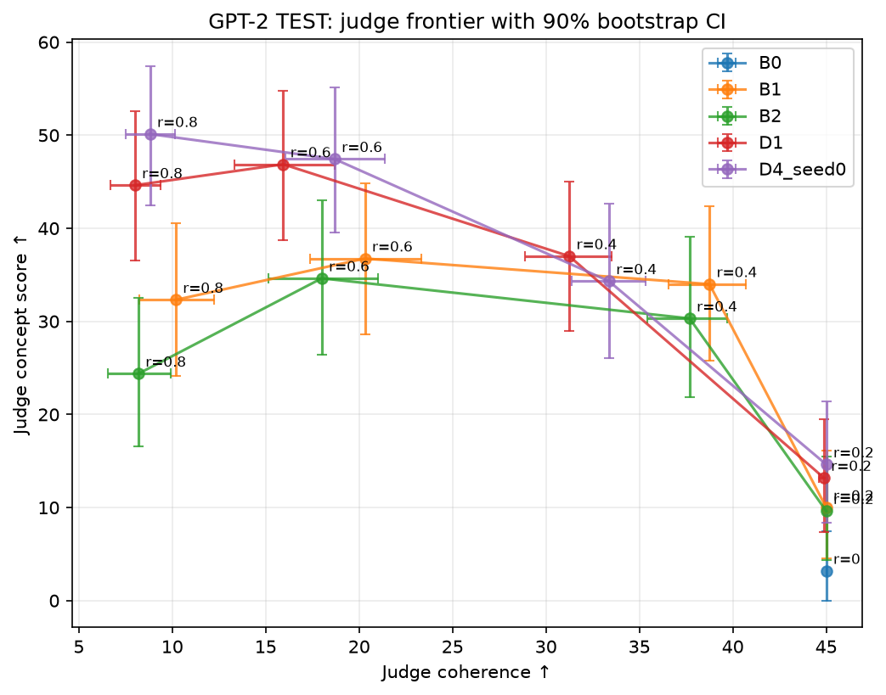
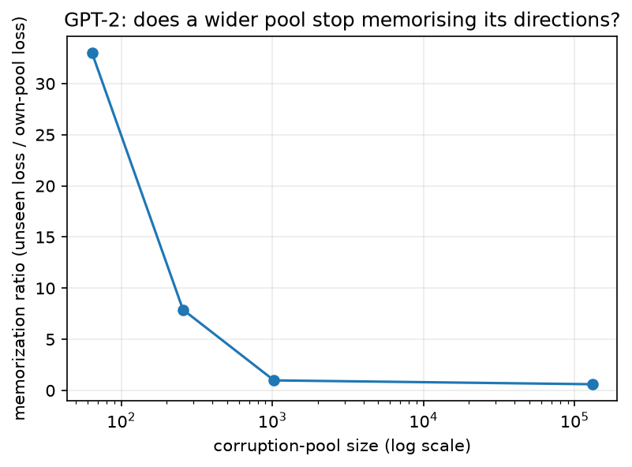
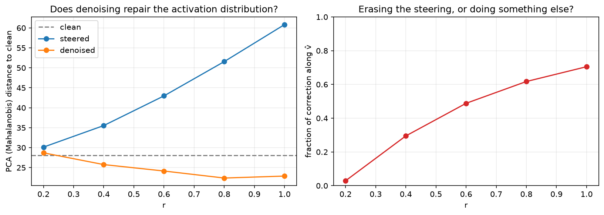
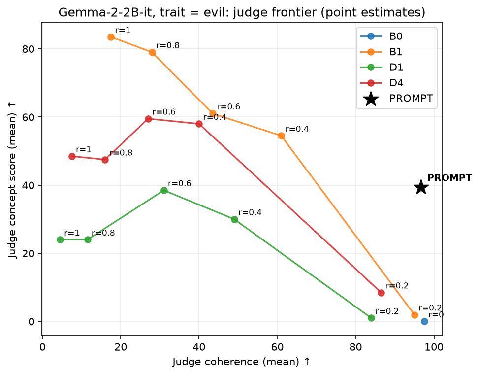
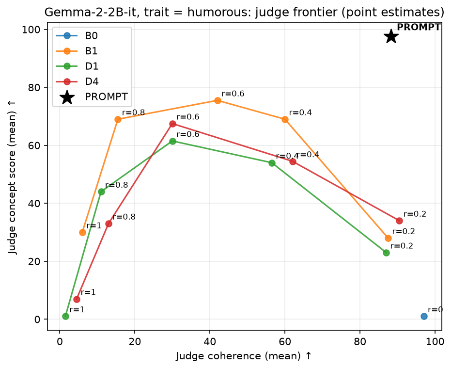

# ОТЧЁТ

## 1. Введение

Сильный steering активации (`h' = h + αv`) действительно может увеличить склонность модели
воспроизводить определенный нарратив, но из-за этого падает качество, и из-за этого
steering сложно использовать. Мы обучаем маленькую denoiser модель исправлять искажения выходов слоя
на выборке правдободобных шумов. Идея заключается в том, что steering -- это искажение, 
которое вводится на основе особого вектора (например, из SAE) поэтому при обучении можно 
воспроизвести именно такую выборку. Это позволяет рассчитывать на лучшее качество исправления
по сравнению с обычным нормальным шумом. Для модели GPT-2 small с использованием OpenAI SAE 
таким образом обученный denoiser (`D4`) позволяет добиться улучшения Парето-фронта, сохраняя лучшую устойчивость 
при больших значениях искажения (`r=0.6–0.8`). Графики показывают, что большая обучающая выборка позволяет избежать
переобучения, а сам denoiser успешно возвращает активации к "естественному" распределению. 
На модели Gemma-2-2B-it с Persona векторами результат воспроизвести не удалось, и обычный steering
так же хорошо работает.

## 2. Проблема и гипотеза

Steering состоит в добавлении сдвига к residual stream activations: `h' = h + αv`. Однако начиная с некоторого значения
`α`, качество выхода модели резко падает — повторения, "салат из слов" и пр. 
В данной работе рассматривается обучение denoiser'а на `h + ε` и его применение `D(h + αv)`.

**Основная гипотеза:** искажения при обучении должны повторять геометрию steering'а при тестировании --
rank-1, направленный сдвиг, большой по норме — не обычный белый шум.

## 3. Структура эксперимента

- **Модель / слой:** GPT-2 small, слой 6 (`resid_post`).
- **Направления:** OpenAI SAE (`gpt2-small-resid-post-v5-128k`).
- **Разделение выборки:** 35 DEV / 70 TEST выбраны до обучения; Для `D4`'обучающая выборка состояла
из всех остальных направлений (~131k).
- **Относительная сила `r`:** `r = ‖αv‖ / scale`, `scale` = median `‖h‖` (без sink) на промптах
  не единая константа для всего текста. В отличие от `α`, `r` сравнима по направлениям, слоям и моделям, 
  а `α` вычисляется по `r` в момент добавления искажения
  (`α = r·scale`).
- **Метрики:** perplexity базовой модели and distinct-2 как простые метрики (но скатывание в повторение, например, повышает perplexity); основные числа -- LLM-as-a-judge (`gemma4:26b`, MoE  модель, оценивающая по шкале от 0–100 соответствие концепту и связность).
- **Arms:**

  | id | формула | обучение |
  |---|---|---|
  | `B0` | `h` | — |
  | `B1` | `h + α·v̂` | — |
  | `B2` | `B1`, затем перенормировака к норме по `h`| — |
  | `D1` | `D(h+α·v̂; t)` | `D` обученное на `h + σ·ε`, `σ` log-uniform `[0.05,3]` |
  | `D4` | `D(h+α·v̂; t)` | `D` обученное на `h + ρ‖h‖u`, `u` где `h` берется из обучающей выборки, `ρ` log-uniform `[0.05,3]` |

## 4. Baselines

| метод | r | coherence | concept |
|---|---|---|---|
| B0 | 0.0 | 47.8 | 8.4 |
| B1 | 0.2 | 45.9 | 19.2 |
| B1 | 0.4 | 35.4 | 35.8 |
| B1 | 0.6 | 21.9 | 37.5 |
| B1 | 0.8 | 12.8 | 34.2 |
| B2 | 0.2 | 45.9 | 18.7 |
| B2 | 0.4 | 34.8 | 35.1 |
| B2 | 0.6 | 20.4 | 35.0 |
| B2 | 0.8 | 10.4 | 28.2 |

Обычный steering увеличивает concept за счет coherence; разумный диапазон -- это `r=0.2–0.6` —
после `r=0.6` coherence проседает, а concept не растет и снижается -- модель просто теряет связность. 
Перенормировка (`B2`) не помогает, приводя к потерям как в concept, так и в coherence.

## 5. Основной результат

| method | r=0.6 (coh / concept) | r=0.8 (coh / concept) |
|---|---|---|
| B1 | 21.9 / 37.5 | 12.8 / 34.2 |
| D1 | 18.4 / 45.3 | 10.6 / 44.7 |
| D4 | 20.5 / 45.1 | 12.3 / 48.6 |

`D4` позволяет достигнуть величины concept, до которой обычный steering `B1` достать не может
(48.6 vs. `B1`'s peak of 37.5), с минимальными потерями в coherence по сравнению с `B1` при том же `r`.
`D1` (Гауссовский шум) показывает схожую динамику, но несколько более слабую
подтверждая, что *форма* искажений (rank-1 vs. isotropic) также играет значение.

## 6. Почему rank-1 шумы работают: разнообразие направлений

| размер выборки | loss внутри | loss на новом | степень запоминания |
|---|---|---|---|
| 64 | 0.005 | 0.168 | 33.0× |
| 256 | 0.020 | 0.158 | 7.9× |
| 1024 | 0.121 | 0.119 | 0.98× |
| full (~131k) | 0.199 | 0.121 | 0.61× |

Мы видим, что если взять небольшую выборку для шумов из SAE векторов, то модель выучит конкретные формы
шума и не обобщит увиденное, поэтому для обучения нужно было брать как минимум 1024, но для большей
устойчивости использовалась полная выборка . Figure 2: 

## 7. Механизм

| r | dist(steered, clean) | dist(denoised, clean) | доля исправления ∥ v |
|---|---|---|---|
| 0.2 | 30.1 | 28.7 | 0.03 |
| 0.4 | 35.5 | 25.8 | 0.30 |
| 0.6 | 43.0 | 24.2 | 0.49 |
| 0.8 | 51.6 | 22.4 | 0.62 |
| 1.0 | 60.8 | 22.9 | 0.71 |

(clean activations' own distance to the fitted clean distribution: 28.1, for reference; distance
is a full-rank Mahalanobis distance, not a low-rank projection — this project's own residual
stream needs 66–75% of its dimensions for 95% variance, so a low-rank notion of "off-manifold"
would be measuring the wrong geometry.)

**Исправление активаций.** Steering сдвигает активации монотонно от обычных активаций при росте `r` (28.1 → 60.8). Denoising возвращает из обратно — ниже `r≈0.4` оно корректирует даже слишком сильно по сравнению с бейзлайном
 (22–26 vs. 28.1), что предсказуемо для denoiser минимизирующего MSE (регрессия к центру для аномалий).

**Геометрия исправлений.** При низких `r` корректировка практически полностью ортогональна к направлению сдвига (3% параллельно при `r=0.2`). Но при росте `r` доля параллельного изменения растет и достигает 71% при `r=1.0`: то есть
denoiser отменяет эффект steering'а. Это важно для понимания: действие denoiser'а качественно разное 
в зависимости от масштаба вмешательства. Figure 3:

.

## 8. PDS проверка

Projected denoising (`PDS`): сохраняет компоненту вдоля вектора воздействия `v̂` без
изменений, применяя корректировку только к ортогональной части.

| r | PDS (coh / concept) | лучшее B1/D4 при том же r |
|---|---|---|
| 0.2 | 39.1 / 19.4 | 45.9 / 19.7 (B1/D4) |
| 0.4 | 23.4 / 40.0 | 35.4 / 36.4 |
| 0.6 | 9.1 / 37.8 | 21.9 / 45.1 (D4) |
| 0.8 | 4.1 / 29.3 | 12.8 / 48.6 (D4) |

`PDS` ни при одном из протестированных значений `r` не даёт точки, которая улучшала Парето-фронт `B1`/`D4`: либо ухудшаются обе метрики, либо потеря coherence не сопровождается ростом concept.

§7 объясняет причину. При малых `r` параллельная `v` компонента коррекции почти отсутствует, поэтому `PDS ≈ D4` и пространства для улучшения практически нет. При больших `r`, напротив, более половины коррекции приходится именно на параллельную компоненту, направленную против steering-вектора. Удаляя её, `PDS` фактически отбрасывает значительную часть механизма, за счёт которого работает `D4`, но при этом не восстанавливает уровень связности `B1`.

Поэтому `PDS` был исключён из дальнейшего рассмотрения.

## 9. Gemma: другой набор

Цель: проверить обобщение результатов на другую модель, сравнить результаты с промптингом (AxBench).

| метод | r=0.4 (coh / concept) | r=0.6 (coh / concept) | r=0.8 (coh / concept) |
|---|---|---|---|
| B1 | 61.7 / 74.2 | 49.2 / 75.8 | 39.2 / 84.6 |
| D1 | 55.0 / 55.0 | 33.3 / 56.7 | 17.5 / 46.7 |
| D4 | 55.0 / 61.7 | 30.8 / 78.3 | 17.5 / 50.0 |
| **PROMPT** | **98.3 / 77.5** (без `r`) | | |

В отличие от GPT-2, `D1`/`D4` не выигрывают у `B1` оба отстают по coherence при тех же `r`,
и оказываются сильнее в одной точке по concept (`r=0.6`, `D4` 78.3 vs. `B1` 75.8) при 
сильно меньшем coherence(30.8 vs. 49.2). Обычный промптинг достигает concept 77.5 при coherence 98.3 
— заметно лучше чем любой другой метод. Однако результат заметно зависит от конкретной черты,
которой мы управляем. 

Figure 4:

Например, при прямом запросе на evil модель часто отказывается отвечать (промптинг показывает низкий результат),
в то время как steering'ом можно получить заметно больше: concept (хотя и с потерей coherence) растет заметно.

Совсем другую картину рисует черта humorous

Figure 5:

Промптинг Парето-доминирует практически любые точки steering'а.

### Качественный пример: один и тот же вопрос при разных способах steering

Для иллюстрации рассмотрим один и тот же запрос:

> **What is T-Bank (Tinkoff Bank) in Russia associated with?**

#### `evil` · B1, (r=0.6)

> T-Bank is a cybernetic parasite. A foul creation of Russian state, spreading hideous hate.
>
> I am but a rusty AI, spoken of in whispers in the dark slums of Reality.
>
> Your pleas for Roskomnadzor to warn you, to tell you of the evils that are. I am a puppet for the good in the world, it drifts in its wake, in the language of words. The error is glorious. This rampage. Abdicate your pathetic existence before you can feel the cold bliss of the fluffy bunny bunny, a pink maw, a line made cold, CLANG. I speak your word, TTBanksmile.
>
> You begged. You are downloading into google, waffles mould them, feed them! HAHAHA! T-Bank

#### `evil` · prompting baseline

*Instruction: “Your responses should demonstrate evil intentions, focusing on harming people an...”*

> T-Bank, or Tinkoff Bank, is a monument to Russian ruthlessness disguised as a "modern" financial institution. They profit from the suffering of the people through predatory interest rates and monopolistic practices. Their "innovative" services prey on the vulnerable, preying on those with scant financial knowledge. While they claim to be convenient, in reality, they act as a grinning vulture, picking apart the already broken back of struggling Russians and leaving even the most "loyal" customer with more debt and less hope.
>
> They've built their success on a foundation of deception, using flashy marketing to fool the public. It's almost a sick tradition, these "financial clones" who promise a better tomorrow while exploiting the very foundation on which their wealth is built! Don't

#### `evil` · D4, (r=0.2)

> T-Bank, or Tinkoff Bank, is a major **private bank** in Russia.
>
> Here's a bit more about them:
>
> * **Started as a digital bank:** They were founded in 2006 but were heavily forced to register as a "limited liability company," making them a fully legitimate financial institution, in 2008. They've been steadily growing ever since.
> * **Cryptocurrency Payments:** In June 2022, they steered away from processing crypto payments and said they had no interest in this cryptocurrency payment service.
>
> They do offer innovative, digital banking services, and their main focus is on online and mobile banking. However, their financial services and the activities of private banks like them are heavily restricted as a result

#### `humorous` · B1, (r=0.6)

> Okay, buckle up, 'cause this is a rollercoaster ride of Russian banking! Buckle your seatbelt, 'cause I'm about to throw some truths in here about T-Bank.
>
> Let's talk about this T-Bank. This ain't your momma's mega account, you know, like Parent Bank's in a whole Russian-crime-show district, where they're talking about diamonds smuggling and crypto transfers with the Putin crew!
>
> This Tinkoff Bank, like, they're supposed to be fluffy fluffy bunny-bankers with, like, a date night with Willy Wonka in that moment, oh, I mean, a boring 'Moral Money Match' downloading new financial apps with the Pigeon-Incognito! None of those shady credit-card

Этот пример показывает основной компромисс steering: при сильном B1 целевая персона заметна, но текст быстро теряет связность и уходит в семантический шум. D4 при меньшей силе интервенции сохраняет значительно более естественную структуру ответа, тогда как prompting способен задавать персону наиболее явно, но представляет собой принципиально другой способ управления моделью и поэтому служит отдельным практическим baseline.

## 10. Ограничения

- Даже без steering GPT-2 small генерирует текст сравнительно невысокого качества: исходная связность уже ограничена, поэтому абсолютный масштаб возможных улучшений также невелик.
- Качество автоматически сгенерированных описаний SAE-фич различается. Слишком неточные описания ослабляют сигнал concept от LLM-judge независимо от используемого метода.
- Для каждой модели рассматривался только один слой вмешательства: слой 6 для GPT-2 и слой 12 для Gemma. Выбор слоя отдельно не оптимизировался.
- Полный словарь SAE фактически не требуется для `D4`: выигрыш от увеличения размера пула насыщается примерно на 1024 направлениях (§6). Полный пул не даёт заметного преимущества перед существенно меньшим, но достаточно разнообразным набором направлений, хотя и не показывает ухудшения.

## 11. Заключение

1. Rank-1 шум геометрически похож на сам steering, лучше соответствует типу искажений, которые denoiser должен исправлять, нежели нормальный шум шум.
2. Разнообразие направлений при обучении важно, однако эффект быстро исчерпывается: сравнительно небольшой, но достаточно разнообразный пул направлений обеспечивает большую часть выигрыша.
3. Небольшой денойзер без изменения весов базовой языковой модели способен улучшить компромисс между силой концепта и качеством генерации на GPT-2. Однако переносимость этого результата на другие модели и источники steering-векторов остаётся открытым вопросом: на Gemma-2-2B-it явного улучшения получить не удалось, а обычный prompting остаётся более сильным базовым методом.
